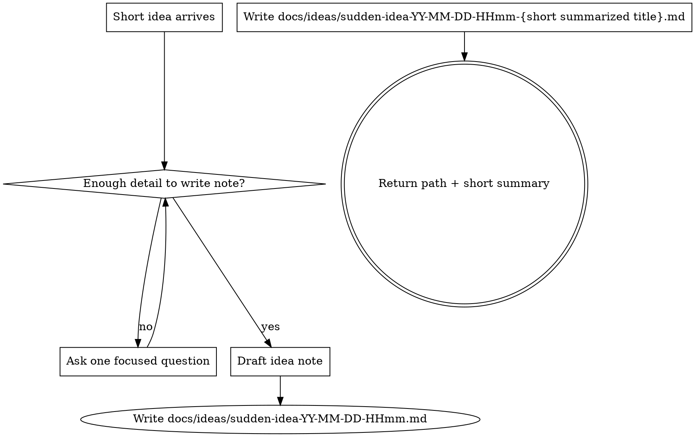

# Sudden Idea

## Overview

Turn a short, abrupt idea into one concrete idea note.

Core principle: do not stop at interpreting the idea. Ask enough questions to remove ambiguity, then write the result to a timestamped file in docs/ideas.

## When to Use

Use this when the user drops a brief product or feature thought such as:

- "suddenly: minimap for globe exploration"
- "suddenly add offline terrain cache"
- "new idea: guided river flythrough"

Use it when the prompt is too short to implement safely and the real task is capturing and sharpening the idea.

Do not use it when:

- the user already asked for implementation
- the user wants a design spec in docs/superpowers/specs
- the user is just brainstorming verbally and does not want a file written

## Required Flow



## Rules

- Ask clarifying questions one at a time.
- Prefer multiple choice when possible.
- Keep questions aimed at writing the note, not at implementation planning.
- Do not stop after asking a good question. Continue the interaction until a file is written, unless the user stops replying or changes the task.
- Once the core intent is clear, write the markdown file immediately.
- The filename must be `sudden-idea-YY-MM-DD-HHmm-{short summarized title}.md` using the current local time.
- Save the file under `docs/ideas/` at the repository root.
- If the user already provided enough detail, skip questions and write the file directly.
- Always finish by telling the user which file was created and giving a 1-2 sentence summary.

## Idea Note Template

Use this structure:

```md
---
done: no
comment: ""
---

# Sudden Idea

## Source Prompt

<the user's original short prompt>

## Intent

<plain-language description of what the user appears to want>

## Proposed Shape

- <main capability>
- <important interaction or workflow>
- <important scope boundary>

## Open Questions

- <remaining ambiguity>

## Next Step

<smallest sensible next design or implementation step>
```

The frontmatter fields:

- `done`: `no` by default. Set to `yes` when the idea is implemented **or** deliberately cancelled.
- `comment`: free-form explanation — e.g. why it was cancelled, which PR implemented it, or any follow-up notes.

## Quick Reference

| Situation                                 | Action                                   |
| ----------------------------------------- | ---------------------------------------- |
| Prompt is one short phrase                | Ask the single most informative question |
| Prompt already contains scope and outcome | Write the note immediately               |
| User answers partially                    | Ask one more focused follow-up           |
| Intent is clear enough                    | Stop asking and create the file          |

## Common Mistakes

| Mistake                                       | Fix                                                                              |
| --------------------------------------------- | -------------------------------------------------------------------------------- |
| Explaining the feature but not writing a file | Create the note under docs/ideas before replying                                 |
| Jumping into implementation planning          | Capture the idea only; implementation can come later                             |
| Asking a large batch of questions             | Ask one focused question at a time                                               |
| Using an arbitrary filename                   | Use the required `sudden-idea-YY-MM-DD-HHmm-{short summarized title}.md` pattern |

## Red Flags

- "I can turn this into a plan next" before writing the idea file
- "Here are some possibilities" with no saved note
- three or more questions at once
- asking one clarifying question and ending the task there
- writing to docs/superpowers/specs instead of docs/ideas

All of these mean the skill was not followed. Return to clarification, then write the idea file.
