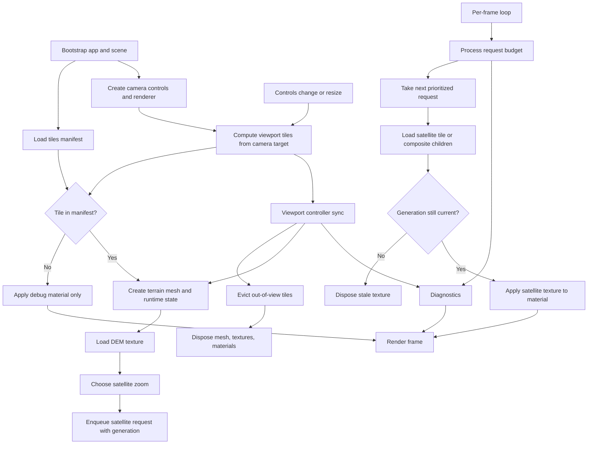

# Tiling Rendering Logic (Intro)

This document explains how the Lancangriver client renders terrain tiles and satellite imagery in the current Three.js pipeline.

Scope: `app/lancangriver/client/src/main.ts` and helpers under `app/lancangriver/client/src/view`.

## Big-Picture Render Graph

## 1) High-Level Pipeline

At runtime, the renderer keeps a fixed DEM tile zoom, streams visible `z/x/y` tiles around the camera target, and upgrades each visible tile's satellite texture through a request budget.

Flow summary:

1. Compute origin tile from startup lon/lat.
2. Build the scene, camera, controls, and diagnostics overlay.
3. Compute visible tile set from camera target + viewport size.
4. Sync tile set into a viewport controller:
   - Add new tiles (async load path).
   - Dispose tiles no longer needed.
5. For each manifest-hit tile:
   - Create plane mesh at world position.
   - Load DEM texture.
   - Queue satellite texture request (with generation id).
6. Per animation frame:
   - Process limited satellite request budget.
   - Apply upgraded textures to matching tile generation only.
   - Render frame.

## 2) Coordinate and Tile Model

- Tile key: `{ z, x, y }`.
- Fixed terrain zoom is currently hardcoded (`FIXED_TILE_ZOOM = 11`).
- `lonLatToTile` maps startup lon/lat into Web Mercator tile indices.
- Each terrain tile is represented as a plane mesh:
  - Width/height: `TILE_SIZE * TILE_SCALE`.
  - Segments: `TERRAIN_SEGMENTS`.
  - Rotated to lie on XZ plane.
- World placement is relative to an origin tile:
  - `x = (tile.x - origin.x) * TILE_SIZE * TILE_SCALE`
  - `z = (tile.y - origin.y) * TILE_SIZE * TILE_SCALE`

This keeps world coordinates local around the selected region instead of using global Mercator meters.

## 3) Viewport to Visible Tile Set

Visible tiles are recalculated in `syncViewport` (called on startup, resize, and map-control changes).

`computeViewportTiles`:

1. Converts camera target (world XZ) back to center tile indices near origin.
2. Computes a radius from viewport pixel size and tile world size.
3. Enumerates a square tile window around the center tile.
4. Clamps x/y to tile-count bounds for the fixed zoom.

The result is a flat list of desired tiles for the current frame context.

## 4) Tile Lifecycle Controller

`createTileViewportController` owns tile entry state (`pending`, `loaded`, `failed`) and enforces desired-set synchronization.

When `sync(nextTiles)` runs:

- Existing entries not in `nextTiles` are evicted and disposed.
- New tile ids trigger `loadTile(tile)` asynchronously.
- If a tile completes after eviction, it is immediately disposed.

This avoids stale tile objects lingering in scene memory.

## 5) Manifest Gating

The client fetches `GET /geo/tiles-manifest` at boot and builds a set of valid tile ids.

- Manifest hit:
  - Tile enters full terrain path.
  - Outline helper is attached for debugging.
- Manifest miss:
  - Tile receives a deterministic debug color material only.
  - No DEM or satellite requests are issued.

This acts as a data-availability guardrail and keeps request volume focused on known-backed tiles.

## 6) DEM + Satellite Material Path

For manifest-hit tiles:

1. Mesh is created and added.
2. DEM texture is loaded from `/raster/dem/{z}/{x}/{y}.png`.
3. Satellite texture request is scheduled (possibly composite).
4. Once both are available, a `ShaderMaterial` is applied.

Vertex shader behavior:

- Samples DEM texture at UV.
- Decodes Terrarium elevation:
  - `elevation = (R*256 + G + B/256) - 32768`
- Displaces plane vertex on local Z axis by `elevation * uElevationScale`.

Fragment shader behavior:

- Samples `uSatelliteTexture` and outputs RGB color.

Note: mesh is rotated by `-PI/2` on X, so local shader displacement maps into world-up after transform.

## 7) Satellite LOD and Compositing

Satellite requests are controlled independently from DEM tile loading.

### 7.1 Target Zoom Selection

- The path currently calls `chooseSatelliteZoom(distance, currentZoom)`.
- In the present implementation, this function returns a fixed zoom (11), so LOD is effectively locked.
- The API already supports distance-based policy evolution.

### 7.2 Child-Tile Coverage

If target satellite zoom is higher than DEM zoom, the client:

1. Enumerates child tiles with `enumerateChildTiles(baseTile, targetZoom)`.
2. Loads all child satellite images.
3. Draws them into a larger canvas in `(offsetX, offsetY)` slots.
4. Creates one `CanvasTexture` used by the terrain material.

This keeps geometry at DEM tile granularity while allowing finer satellite detail.

## 8) Request Budget and Stale-Request Safety

`createSatelliteRequestBudget(maxPerFrame, maxConcurrent)` throttles updates.

Current bootstrap config:

- `maxPerFrame = 2`
- `maxConcurrent = 4`

Queue behavior:

- Requests are sorted by tile distance (nearer first).
- Each request includes `generation` per tile id.
- Newer generations make older queued requests stale.
- On completion, texture is applied only if runtime generation still matches.

This prevents old async responses from overwriting newer desired state while the user pans.

## 9) Frame Loop Responsibilities

Animation loop does three core things:

1. `controls.update()`
2. `processSatelliteRequestBudget()`
3. `renderer.render(scene, camera)`

So tile set changes happen on control events, while satellite upgrades are incrementally advanced each frame under budget.

## 10) Disposal and Memory Hygiene

When a tile is evicted or app unloads, dispose path tears down:

- Mesh geometry
- DEM texture
- Satellite texture
- Shader/material resources
- Outline geometry/material

Textures loaded but no longer relevant (evicted/stale generation) are explicitly disposed before they can leak.

## 11) Important Extension Points

If you plan to evolve tiling logic, these are the key insertion points:

- Dynamic terrain zoom / multi-zoom geometry:
  - `computeViewportTiles`, `tileToWorldPosition`, and tile runtime keys.
- True distance-based satellite LOD:
  - `chooseSatelliteZoom` in `src/view/satellite-lod.ts`.
- Smarter request prioritization:
  - `createSatelliteRequestBudget` comparator and queue policy.
- Alternate elevation sources/encodings:
  - DEM decode block in terrain vertex shader.
- Better missing-data UX:
  - manifest miss branch in tile loader callback.

## 12) Mental Model

Think of the renderer as two coupled streams:

- Geometry/elevation stream (tile presence + DEM) driven by viewport sync.
- Surface-detail stream (satellite textures) driven by a budgeted async queue.

Both streams are tied together by tile id and generation checks so camera movement can be responsive without allowing stale visual state.
