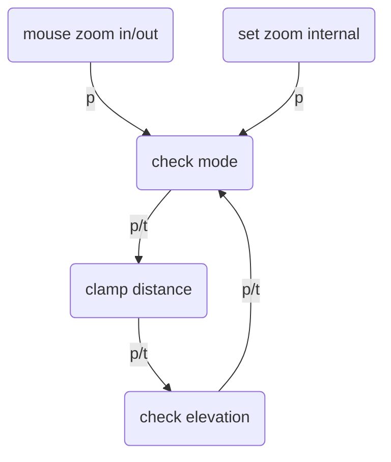

## Problem

It's very hard to determine how to stay and replace the current camera state, need a further clarification.

## State Items

- mode
- position (P)
- target (T)
- minDistance (in short mindist)
- maxDistance (in short maxdist)
- latlng
- alt
- height
- elevation (the max one)
- earthRadius (or radius)

## Thinkings

### Definitions

Let:

- `O` be the world origin.
- `P` be the camera position.
- `T` be the current look-at target.
- `N = normalize(P - O)` be the radial surface normal below the camera.
- `R = earthRadius + elevationMax` be the active raised-ground radius.
- `PT = P - T` be the camera-to-target vector.
- `TP = T - P` be the camera forward direction. It is the direction of local `-Z`, not local `+Z`.
- `distance = length(PT)` be the camera-to-target distance.
- `height = length(P) - R` be the camera height above the active raised sphere.

`altitude` and `height` are not interchangeable: `altitude` is measured above the ideal Earth radius, while `height` is measured above the active raised surface.

`mindist` and `maxdist` are mode-dependent limits:

- In `orbit` mode, they are ground-relative heights: `height` must be in `[mindist, maxdist]`.
- In `map` mode, they are camera-to-target distances: `distance` must be in `[mindist, maxdist]`.

### Pose invariants

1. `P`, `T`, and the camera orientation are the pose. Do not treat `target` as the only orientation state: `lookAt(T)` recomputes the orientation from `P`, `T`, and `up`.
2. In `map` mode, translating the ground target must preserve the camera offset `P - T` before re-projecting the new target onto the active sphere. Then set `P = T + offset` and rebuild the orientation.
3. In `orbit` mode, `T = O = (0, 0, 0)`. `mindist` and `maxdist` constrain `height = length(P) - R`, so clamp `length(P)` to `[R + mindist, R + maxdist]`.
4. In `map` mode, clamp `distance = length(P - T)` to `[mindist, maxdist]`. The target `T` lies on the active sphere, so this is the camera-to-target range used by map interactions.
5. When switching from `orbit` to `map`, set `T = normalize(P) * R`. The new map distance is then the current orbit height, so the transition preserves zoom when that value is within the map limits.
6. When switching from `map` to `orbit`, set `T = O`. The current map distance is not the orbit constraint; convert to the orbit height `length(P) - R` and clamp it to `[mindist, maxdist]` while preserving the camera's geographic direction where possible.
7. A mode switch must update the mode-specific target and limits before clamping. It should not unexpectedly change the geographic location or apply `R` twice.

### Interaction semantics

8. Zoom changes `P` along the current `P - T` direction and preserves `T`. In `orbit` mode clamp by `height`; in `map` mode clamp by `distance`.
9. Press-drag panning is enabled only in `map` mode. It changes `T` along the local tangent plane, re-projects `T` to radius `R`, and applies the same `P - T` offset to `P`.
10. Yaw and pitch are enabled only in `map` mode. They rotate the camera orientation around its local axes without directly moving `P`; after the rotation, update `T` to the intersection of the new camera ray with the active ground sphere when an intersection exists.
11. In `orbit` mode, yaw, pitch, and press-drag panning must not change the camera's local X/Y orientation. These controls are disabled there; orbit rotation remains a separate spherical-position operation.
12. Roll rotates the camera around its view axis (`TP`, equivalently the camera's local Z axis as a line). Roll does not change `P` or `T`.

### Camera up

13. The raw radial vector `N` is the natural world-space direction toward the sky, but it is not always a valid `camera.up`: it must be made perpendicular to the view direction before calling `lookAt`.

```ts
const viewDir = target.clone().sub(position).normalize();
const surfaceNormal = position.clone().sub(origin).normalize();
const up = surfaceNormal
  .sub(viewDir.clone().multiplyScalar(surfaceNormal.dot(viewDir)))
  .normalize();
camera.up.copy(up);
camera.lookAt(target);
```

If `surfaceNormal` is parallel or nearly parallel to `viewDir`, the projected vector is undefined or numerically unstable. Use a fallback tangent in that case. Keep `camera.up` as a unit direction; its magnitude is not meaningful.

`syncUp()` should run whenever `P`, `T`, or the view direction changes, before `lookAt()`. A user roll can then be applied as an additional rotation of this reference up vector around `viewDir`; do not overwrite it with `(0, 1, 0)` during later camera updates.

### State update order

For every camera operation, use this order:

1. Update the mode-specific state (`P`, `T`, or the orientation).
2. Re-project `T` and clamp the relevant distance/height.
3. Compute `camera.up` from the local surface frame and the current view direction.
4. Call `camera.lookAt(T)` and update the camera matrices.
5. Derive `height`, `altitude`, `distance`, `latlng`, and zoom from the final pose.

This keeps published telemetry consistent with the actual camera instead of with an intermediate target or radius.

#### Graph


